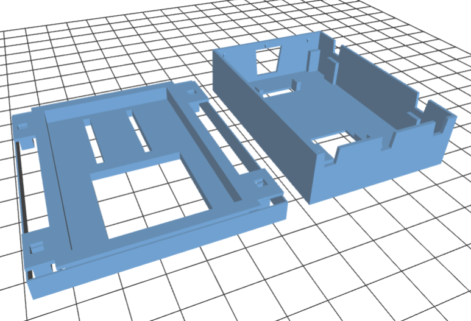

Fingerprint_Scanner-TTL
=======================

[  
*Fingerprint Scanner - TTL (GT-511C3)(SEN-11792)*](https://www.sparkfun.com/products/11792)

This is a great fingerprint module from ADH-Tech that communicates over TTL Serial so you can easily embed it into your next project. 

This repository contains example code to work with it. 

Repository Contents
-------------------
* **/FPS_GT511C3** - Arduino Library to interface with the sensor.

* Modified for Particle Photon by Paul Kourany (peekay123), Oct 24, 2015
* 
* Updated by Jeremy Ellis Mar 8, 2016
* 
* 

A 3d printed case for the pHoton and fingerprint scanner is at [https://github.com/hpssjellis/my-3D-printing-stl/tree/master/particle-photon](https://github.com/hpssjellis/my-3D-printing-stl/tree/master/particle-photon)

which looks like

Here is what the connections to the Fingerprint Scanner look like

Here is how the wires attach to the Photon

Green to Rx

Yellow to TX

Black to GND

Red to Vin

Here is what the recipe on http://ifttt.com looks like when it is fully made

License Information
-------------------

The original library license is as follows:

"	Created by Josh Hawley, July 23rd 2013
	Licensed for non-commercial use, must include this license message
	basically, Feel free to hack away at it, but just give me credit for my work =)
	TLDR; Wil Wheaton's Law "
